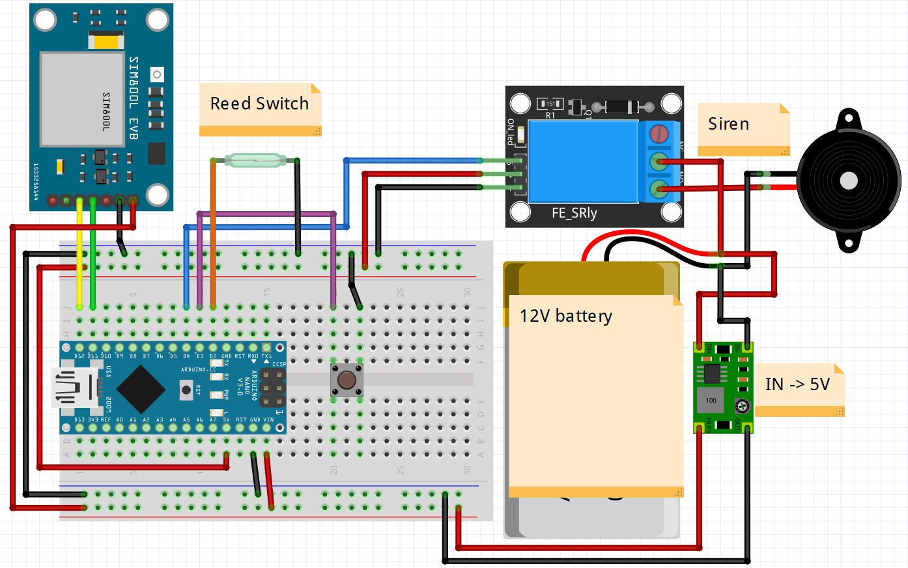

# SecureDoors

Alarm for your door with SMS or call notification

## There are two versions of this project

1. main.ino
   1. Makes X calls as a notification
   2. Disarmed state is active until door is closed
2. alt.ino
   1. Sends an sms as a notification
   2. Disarmed state is active for declared time

### You can use those files to modify behaviour of this device

## Technical differences between those files

The main differences are in the `toggle_alarm` function. [`main.ino`](./main/main.ino) file has also a function called `hang_up_call` which does not appear in [`alt.ino`](./alt/alt.ino) file.

# What such device should do

- When door is opened (REED SWITCH IS OPENED)
  - Makes X calls (You specify duration and count of those)
  - Turns on a siren (You specify a delay between opening a door and toggling a siren and the duration of the alarm)
- When disarm button is pressed
  - Disarms the alarm

# Parts used for this project

- Arduino Nano (or UNO, It's basically the same)
- Reed Switch (Normally closed)
- Siren (Or any other sound emmiter working by applying voltage)
- SIM800L EVB 2.0 GSM module.
- 1CH Relay (Low level trigger)
- Pushbutton
- Battery, or any other power source (Prefferably 12V)
- Step-down converter (On output 5V and min. 2.2A)

# Libraries used for this project

- SoftwareSerial.h (https://www.arduino.cc/en/Reference/SoftwareSerial)
  - Note: This library is installed with Arduino IDE

# Schematics and diagrams

## Diagram

## Schematics

Not yet released
