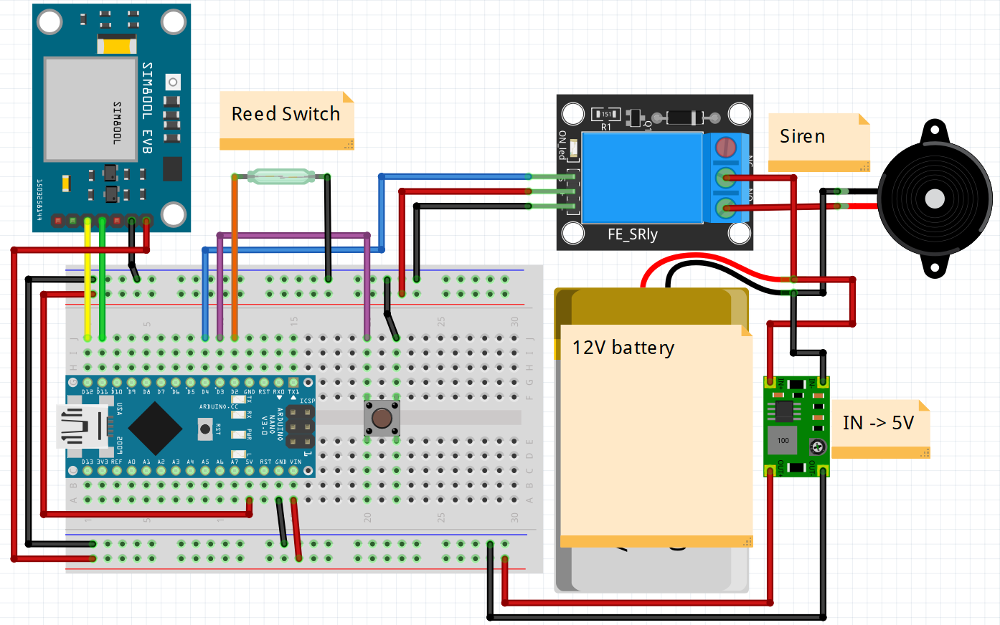

# SecureDoors Troubleshooting Manual

## Table of Contents:

1. [**Testing connections**](#Testing-connections)
2. [**Testing components**](#Testing-components)
    1. [Testing a reed switch and pushbutton](#Testing-reed-switch-and-pushbutton)
    2. [Testing an Arduino](#Testing-an-Arduino)
    3. [Testing a SIM800L EVB V2 module](#Testing-SIM800L-EVB-V2-module)
    4. [Testing a relay](#Testing-a-relay)
    5. [Testing a siren](#Testing-a-siren)
3. [**Debugging the code**](#Debugging-the-code)

# Testing connections

Necessary equipment to perform these actions:

- Multimeter with countinutiy beep

Check countinuity of each connection while following the [diagram or schematics](./schematics)



If everything is connected correctly, follow next steps.

# Testing components

It is possible, that the reason for your device not working is/are malufunctioning component/s. Perform these actions in order to check what is causing issues.


# Testing reed switch and pushbutton

The reason of your device not working might be false readings from those components. To check if that's the case you will need:

- Multimeter with countinutiy beep

Check how behaves a reed switch, Does multimeter beep when magnet is in contact with a reed switch? Does mulitimeter stop beeping when magnet is not in contact with a reed switch? If so, this part is working, as it should. If it's oposite you will need to change code in [main/main.ino](./main/main.ino). Add/remove "!" character standing in front of `digitalRead(REED_SWITCH)`.

Check how behaves the pushbutton. Mulitmeter should beep only when button is pressed.

If both of these components are working, follow next step, else replace those components and check if device is working. 

# Testing an Arduino

There is a possibility of your device not working because of malfunctioning arduino. To check if that's the case you will need:

- Led
- 220ohm resistor
- pushbutton
- breadboard
- jump wires
- usb cable

What we will check?

- Digital pins
- Serial connection

## **Checking digital pins**

Connect your arduino to an led like in this diagram:


And upload this code:

```ino
#define TESTED_PIN 2 // change this number when checking other pin

void setup() {
    pinMode(TESTED_PIN, OUTPUT);
}

void loop() {
    digitalWrite(TESTED_PIN, HIGH);
    delay(2000);
    digitalWrite(TESTED_PIN, LOW);
    delay(5000);
}
```

The output of this code should be an LED blinking. (2 seconds on, 5 seconds off). If that is the output on all digital pins, it means that arduino can apply voltage on those pins.

Now let's check if arduino can detect change on those pins. Connect your arduino to a pushbutton like in this diagram:


And upload this code:

```ino
#define TESTED_PIN 2 // change this number when checking other pin

void setup() {
    pinMode(TESTED_PIN, INPUT_PULLUP);
    pinMode(LED_BUILTIN, OUTPUT); // if your board does not have a builtinled, connect such to a pin 13
}

void loop() {
    if(!digitalRead(TESTED_PIN)) {
        digitalWrite(LED_BUILTIN, HIGH);
    } else {
        digitalWrite(LED_BUILTIN, LOW);
    }
}
```

The output of this code should be an led glowing only when button is pressed. Check all pins.

## **Checking serial connection**

If that works, check the Serial communication. Connect your arduino to the computer, upload this code and open Serial monitor on baud: 9600.

```ino
void setup() {
    Serial.begin(9600);
}

void loop() {
    while(Serial.available()) {
        Serial.println(Serial.read());
    }
}
```

After you open a serial monitor type something in a input box and click send. Arduino should reply with the same text as you sent.

# Testing SIM800L EVB V2 module

When your device is not making calls or does not send sms's as it should proceed with these steps. Otherwise you can skip this section.

Connect this module just like in SecureDoors diagrams and schematics ([schematics/diagram.png](./schematics/diagram.png) or [schematics/schematics.fzz](./schematics/schematics.fzz)).

**Note: This module needs power of 5V and at least of 2A to work properly. QuickCharge compatible phone chargers may not work for this purpose. Most problems with SIM800L are a result of not enough current being applied on this module.**

Upload this code:

```ino
#include <SoftwareSerial.h>
SoftwareSerial gsm_conn(11, 12);

void setup() {
    Serial.begin(9600);
    gsm_conn.begin(9600);
}

void loop() {
    while(Serial.available()) {
        gsm_conn.println(Serial.read());
    }

    while(gsm_conn.available()) {
        Serial.println(gsm_conn.read());
    }
}
```
Arduino will pass everything you send from serial monitor to SIM800L module.

### **Use those commands to check if this module works**
**`AT`** - The response should be: **`OK`**, if it's not, arduino is not communicating with this module.  
**`AT+CSQ`** - The response should be looking like this: **`+CSQ:24,0`**. First number indicates signal strength, greater is better, max is 31, 99 means it has no signal. Second number indicates Bit Error Rate. This number should be closer to 0  
**`AT+CERG?`** - The response should be looking like this **`CREG:1,4`**. Ideal reply is:

- **`+CERG:1,3`**
- **`+CERG:1,4`**
- **`+CERG:1,5`**
- **`+CERG:1,6`**

# Testing a relay.

Check at what level relay is triggered. Code was written for low level trigger relays. If your relay is triggered by high voltage replace in `main/main.ino` words `LOW` and `HIGH` with each other.

If that's not an issue check relay by connecting `+` or `VCC` and `IN` pins to 5V power source and `GND` pin to ground. In this state relay should not be triggered. Disconnect 5V from `IN` pin of an relay. Now it should be triggered.

# Testing a siren.

Apply sufficient voltage to siren and check if it makes a sound. Caution for your ears.

# Debugging the code

Build a device using SecureDoors [diagram and schematics](./schematics). Since arduino uno/nano do not support debugging natively paste this code into `main/main.ino` file. 

Into setup():

```ino
Serial.begin(9600);
```

Into loop():

```ino
Serial.print("Reed: ");
Serial.print(digitalRead(REED_SWITCH));
Serial.print("; Triggerable: ");
Serial.print(is_alarm_triggerable);
Serial.print("; Toggled: ");
Serial.print(is_alarm_toggled);
Serial.print("; Disarmed: ");
Serial.print(is_alarm_disarmed);
Serial.print("; Call: ");
Serial.println(is_call_made);
```

Open a serial monitor. You should see output like this:

```
Reed: 0; Triggerable: 1; Toggled: 0; Disarmed: 0; Call: 0
```

### **Explaination of the output**

First number indicates the state of a reed switch. 1 means that doors are open.<br>
Second number indicates the state of an alarm. It cannot be triggered when 0.<br>
Third number shows if alarm has been activated. 1 means yes.
Forth number shows if alarm is in a disarmed state. 1 means yes.
Fith number indicates that call has been made and wasn't hung up. 1 means yes.

### **Expected output**

When device turned on and alarm has not been activated output should look like:

```
Reed: 0; Triggerable: 1; Toggled: 0; Disarmed: 0; Call: 0
```

When the door is opened.

```
Reed: 1; Triggerable: 1; Toggled: 1; Disarmed: 0; Call: 0
```

After TIME_FOR_DISARMING (default: 15s)

```
Reed: 1; Triggerable: 1; Toggled: 1; Disarmed: 0; Call: 1
```

After pressing disarm button (doors should be open)

```
Reed: 1; Triggerable: 1; Toggled: 0; Disarmed: 1; Call: 0
```

When alarm was running for longer than ALARM_DURATION

```
Reed: 1 or 0; Triggerable: 0; Toggled: 0; Disarmed: 0; Call: 0
```
